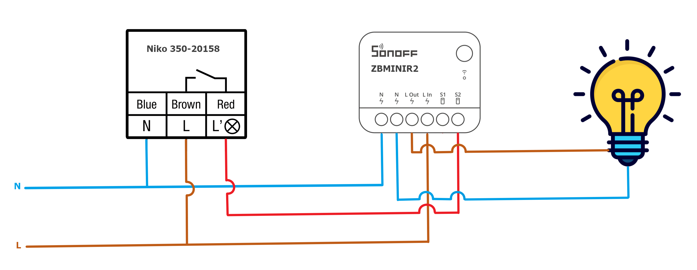

# Installatiehandleiding
## Niko Bewegingsmelder + Sonoff ZBMINIR2 Extreme

---

## Doel

Deze opstelling combineert:

- Bewegingsdetectie
- Slim relais (Zigbee)
- Manuele bediening
- Automatische uitschakeling

Resultaat: **professionele lichtsturing met fallback naar lokale bediening.**

---

## Benodigdheden

- Niko 350-20158 bewegingsmelder
- Sonoff ZBMINIR2 Extreme
- 230V lichtkring
- Neutrale draad
- Inbouwdoos

---

## Veiligheid

⚠️ Altijd spanning uitschakelen.

Belangrijk:

- Gebruik correcte draaddoorsnede
- Respecteer maximale belasting
- Verbind S1/S2 NOOIT met neutraal

---

## Aansluitingen

### Niko

| Draad | Functie |
|--------|-----------|
| Blauw | Neutraal |
| Bruin | Fase |
| Rood | Geschakelde fase |

### Sonoff

| Terminal | Functie |
|-----------|-----------|
| N | Neutraal |
| L In | Fase |
| L Out | Naar lamp |
| S1/S2 | Externe schakelaar |

---

## Bekabeling

### Neutraal
- Net N → Niko  
- Net N → Sonoff  
- Net N → Lamp  

### Fase
- Net L → Niko  
- Net L → Sonoff L In  

### Sturing (Live trigger op S2)
- Niko L’ → Sonoff S2  
- **Sonoff S1 NIET aansluiten**  

### Last
- Sonoff L Out → Lamp  

---

## Schema

## Schema

---

## Testprocedure

1. Spanning herstellen  
2. Sonoff pairen met Zigbee  
3. Bewegingsmelder testen  
4. Manuele schakelaar testen  
5. Timer controleren  

---

Zie automatisatie: [AUTOMATISATIE.md](AUTOMATISATIE.md)
